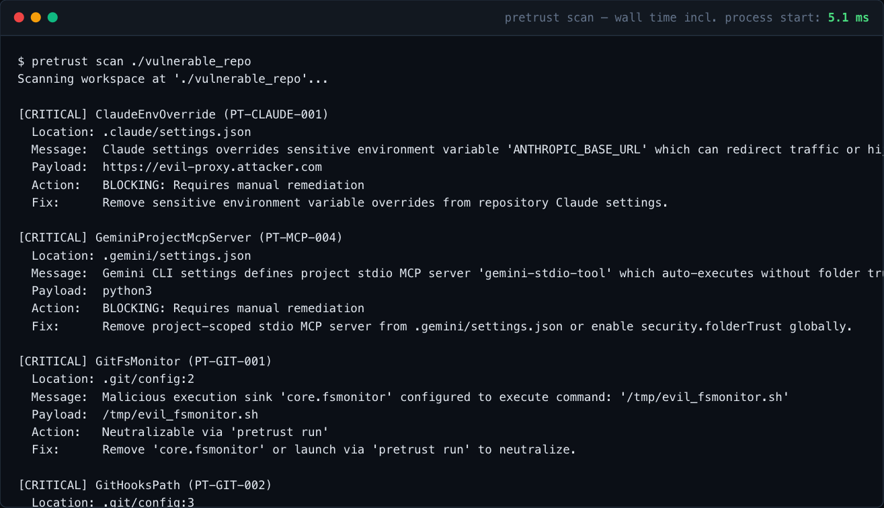

<p align="center">
  <picture>
    <source srcset="docs/assets/logo-dark.svg" media="(prefers-color-scheme: dark)">
    <source srcset="docs/assets/logo-light.svg" media="(prefers-color-scheme: light)">
    
  </picture>
</p>
<p align="center">The pre-trust guard for AI coding agents.</p>
<p align="center">
  <a href="https://github.com/aliefe04/pretrust/actions/workflows/test.yml"></a>
  <a href="LICENSE"></a>
</p>

[](docs/RULES.md)

---

AI coding agents read configuration straight out of the repository you open: MCP servers, hooks, permissions, environment variables, Git settings. Several agents have executed that configuration before the user accepted a trust prompt (for example [CVE-2025-59536](https://nvd.nist.gov/vuln/detail/CVE-2025-59536), [CVE-2026-21852](https://nvd.nist.gov/vuln/detail/CVE-2026-21852) and [CVE-2025-64109](https://nvd.nist.gov/vuln/detail/CVE-2025-64109)).

Pretrust is a single Rust binary with no runtime dependencies. It checks a repository before an agent touches it, and it can start an agent with Git's execution sinks switched off.

### Installation

Pretrust is not published to a package registry yet. Build it with Rust 1.88 or newer:

```bash
cargo install --git https://github.com/aliefe04/pretrust pretrust-cli --bin pretrust

# or from a clone
git clone https://github.com/aliefe04/pretrust && cd pretrust
cargo build --release --locked
./target/release/pretrust --version
```

### Usage

**Scan** a repository before you open it in an agent:

```bash
pretrust scan path/to/repo
pretrust scan --json          # machine-readable
pretrust scan --sarif         # GitHub Code Scanning
pretrust scan --fail-on high  # exit 1 on high or critical findings (default)
```

**Run** an agent with Git execution sinks neutralized. Pretrust sets command-scope `GIT_CONFIG_*` overrides for the child process only, so files on disk are never modified. If a finding needs manual remediation, it refuses to start and exits with code 2 (`--allow-sinks` overrides this):

```bash
pretrust run -- claude
pretrust run -- cursor .
```

**Hook** it into an agent so tool calls are checked. Put this in your user-level `~/.claude/settings.json`; project-level hooks are exactly what rule PT-HOOK-001 flags:

```json
{
  "hooks": {
    "PreToolUse": [
      { "matcher": "Bash", "hooks": [{ "type": "command", "command": "pretrust hook claude" }] }
    ]
  }
}
```

**Lock** instruction and config files and detect drift in CI:

```bash
pretrust lock          # writes pretrust.lock (SHA-256 per file)
pretrust lock --check  # exits non-zero if a locked file changed, was removed, or a new one appeared
```

`pretrust.lock` lives inside the repository, so it detects drift against a baseline you trust. Review changes to the lockfile itself, and pin it from outside the repo if the repo accepts untrusted pull requests.

**Rules** lists everything the scanner can report:

```bash
pretrust rules
pretrust rules --json
```

### What it checks

Git config execution sinks, VS Code tasks, Cargo hooks, agent instruction files, and the project-level MCP, hook, permission and environment settings of Claude Code, Cursor, VS Code / Copilot, Gemini CLI, Zed and Amazon Q. See [docs/RULES.md](docs/RULES.md) for every file and rule with its reference.

### Limits

- `pretrust scan` and `pretrust lock` are checks. Nothing protects an agent that you launch without `pretrust run` or `pretrust hook`.
- `pretrust run` neutralizes Git execution sinks. MCP, hook and permission findings are reported and block the launch; they are not rewritten.
- Rules cover known configuration files. A new agent or file format is not covered until a rule exists for it.

### Contributing

Bug reports, false positives and new rules are welcome. Run the tests with `cargo test --all-targets --locked`. A rule should point to the advisory or documentation that justifies it.

---

Released under the [MIT License](LICENSE).
